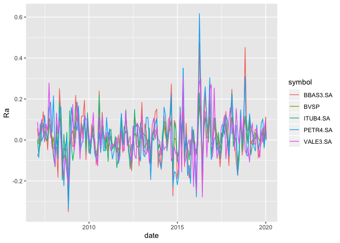
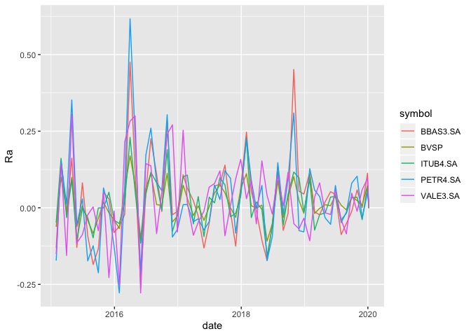
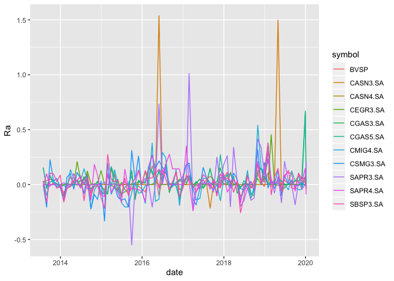

<!-- README.md is generated from README.Rmd. Please edit that file -->

# walle

<!-- badges: start -->

<!-- badges: end -->

The goal of walle is to …


## Installation

You can install the released version of walle from
[CRAN](https://CRAN.R-project.org) with:

``` r
install.packages("walle")
```

And the development version from [GitHub](https://github.com/) with:

``` r
# install.packages("devtools")
devtools::install_github("tomasbarcellos/walle")
```

## Example

Antes de mais nada vamos pegar os dados das ações com formato
padronizado e de acordo com o esperado pelo pacote `tidyquat`.

``` r
library(walle)
acoes <- c("^BVSP", "ITUB4.SA", "BBAS3.SA", "PETR4.SA", "VALE3.SA")
dados <- pegar_acoes(acoes)
#> 'getSymbols' currently uses auto.assign=TRUE by default, but will
#> use auto.assign=FALSE in 0.5-0. You will still be able to use
#> 'loadSymbols' to automatically load data. getOption("getSymbols.env")
#> and getOption("getSymbols.auto.assign") will still be checked for
#> alternate defaults.
#> 
#> This message is shown once per session and may be disabled by setting 
#> options("getSymbols.warning4.0"=FALSE). See ?getSymbols for details.
#> Warning: ^BVSP contains missing values. Some functions will not work if
#> objects contain missing values in the middle of the series. Consider using
#> na.omit(), na.approx(), na.fill(), etc to remove or replace them.
#> Warning: ITUB4.SA contains missing values. Some functions will not work if
#> objects contain missing values in the middle of the series. Consider using
#> na.omit(), na.approx(), na.fill(), etc to remove or replace them.
#> Warning: BBAS3.SA contains missing values. Some functions will not work if
#> objects contain missing values in the middle of the series. Consider using
#> na.omit(), na.approx(), na.fill(), etc to remove or replace them.
#> Warning: PETR4.SA contains missing values. Some functions will not work if
#> objects contain missing values in the middle of the series. Consider using
#> na.omit(), na.approx(), na.fill(), etc to remove or replace them.
#> Warning: VALE3.SA contains missing values. Some functions will not work if
#> objects contain missing values in the middle of the series. Consider using
#> na.omit(), na.approx(), na.fill(), etc to remove or replace them.
```

Agora é hora analisar a performance dessas ações:

``` r
library(tidyverse, warn.conflicts = FALSE)
#> ── Attaching packages ────────────────────────────────────── tidyverse 1.2.1 ──
#> ✔ ggplot2 3.2.1          ✔ purrr   0.3.3     
#> ✔ tibble  2.1.3          ✔ dplyr   0.8.3     
#> ✔ tidyr   1.0.0.9000     ✔ stringr 1.4.0     
#> ✔ readr   1.3.1          ✔ forcats 0.4.0
#> Warning: package 'ggplot2' was built under R version 3.5.2
#> Warning: package 'tibble' was built under R version 3.5.2
#> Warning: package 'purrr' was built under R version 3.5.2
#> Warning: package 'dplyr' was built under R version 3.5.2
#> Warning: package 'stringr' was built under R version 3.5.2
#> Warning: package 'forcats' was built under R version 3.5.2
#> ── Conflicts ───────────────────────────────────────── tidyverse_conflicts() ──
#> ✖ dplyr::filter() masks stats::filter()
#> ✖ dplyr::lag()    masks stats::lag()
library(tidyquant)
#> Warning: package 'tidyquant' was built under R version 3.5.2
#> Loading required package: lubridate
#> 
#> Attaching package: 'lubridate'
#> The following object is masked from 'package:base':
#> 
#>     date
#> Loading required package: PerformanceAnalytics
#> Warning: package 'PerformanceAnalytics' was built under R version 3.5.2
#> Loading required package: xts
#> Loading required package: zoo
#> Warning: package 'zoo' was built under R version 3.5.2
#> 
#> Attaching package: 'zoo'
#> The following objects are masked from 'package:base':
#> 
#>     as.Date, as.Date.numeric
#> 
#> Attaching package: 'xts'
#> The following objects are masked from 'package:dplyr':
#> 
#>     first, last
#> 
#> Attaching package: 'PerformanceAnalytics'
#> The following object is masked from 'package:graphics':
#> 
#>     legend
#> Loading required package: quantmod
#> Warning: package 'quantmod' was built under R version 3.5.2
#> Loading required package: TTR
#> Warning: package 'TTR' was built under R version 3.5.2
#> Version 0.4-0 included new data defaults. See ?getSymbols.
#> ══ Need to Learn tidyquant? ═══════════════════════════════════════════════════
#> Business Science offers a 1-hour course - Learning Lab #9: Performance Analysis & Portfolio Optimization with tidyquant!
#> </> Learn more at: https://university.business-science.io/p/learning-labs-pro </>
RaRb <- criar_RaRb(dados, "monthly")
#> Warning in to_period(xx, period = on.opts[[period]], ...): missing values
#> removed from data
#> Warning in to_period(xx, period = on.opts[[period]], ...): missing values
#> removed from data

#> Warning in to_period(xx, period = on.opts[[period]], ...): missing values
#> removed from data

#> Warning in to_period(xx, period = on.opts[[period]], ...): missing values
#> removed from data

#> Warning in to_period(xx, period = on.opts[[period]], ...): missing values
#> removed from data
RaRb %>%
  tq_performance(Ra = Ra, Rb = Rb,
                 performance_fun = table.CAPM)
#> # A tibble: 4 x 13
#> # Groups:   symbol [4]
#>   symbol ActivePremium    Alpha AnnualizedAlpha  Beta `Beta-` `Beta+`
#>   <chr>          <dbl>    <dbl>           <dbl> <dbl>   <dbl>   <dbl>
#> 1 ITUB4…      0.0329    0.0033           0.0401  1.10   0.995    1.23
#> 2 VALE3…     -0.000600  0.00290          0.0355  1.05   0.905    1.18
#> 3 PETR4…     -0.0515   -0.0037          -0.0434  1.61   1.35     1.82
#> 4 BBAS3…      0.0501    0.0042           0.0511  1.56   1.51     1.81
#> # … with 6 more variables: Correlation <dbl>, `Correlationp-value` <dbl>,
#> #   InformationRatio <dbl>, `R-squared` <dbl>, TrackingError <dbl>,
#> #   TreynorRatio <dbl>

Ra <- criar_Ra(dados)
#> Warning in to_period(xx, period = on.opts[[period]], ...): missing values
#> removed from data

#> Warning in to_period(xx, period = on.opts[[period]], ...): missing values
#> removed from data

#> Warning in to_period(xx, period = on.opts[[period]], ...): missing values
#> removed from data

#> Warning in to_period(xx, period = on.opts[[period]], ...): missing values
#> removed from data

#> Warning in to_period(xx, period = on.opts[[period]], ...): missing values
#> removed from data

Ra %>%
  summarise(media = mean(Ra), desv = sd(Ra),
            cv = desv / media) %>%
  arrange(desc(media))
#> # A tibble: 5 x 4
#>   symbol     media   desv    cv
#>   <chr>      <dbl>  <dbl> <dbl>
#> 1 BBAS3.SA 0.0160  0.118   7.36
#> 2 ITUB4.SA 0.0122  0.0839  6.86
#> 3 VALE3.SA 0.0112  0.104   9.27
#> 4 PETR4.SA 0.0106  0.125  11.8 
#> 5 BVSP     0.00799 0.0623  7.80

ggplot(Ra, aes(date, Ra, col = symbol)) +
  geom_line()
```



Podemos repetir a análise para um período mais recente:

``` r
Ra %>%
  filter(date >= as.Date("2015-01-01")) %>%
  summarise(media = mean(Ra), desv = sd(Ra),
            cv = desv / media) %>%
  arrange(desc(media))
#> # A tibble: 5 x 4
#>   symbol    media   desv    cv
#>   <chr>     <dbl>  <dbl> <dbl>
#> 1 PETR4.SA 0.0300 0.150   5.01
#> 2 VALE3.SA 0.0257 0.129   5.04
#> 3 BBAS3.SA 0.0255 0.132   5.18
#> 4 ITUB4.SA 0.0180 0.0803  4.45
#> 5 BVSP     0.0156 0.0582  3.72

ggplot(Ra %>% filter(date >= as.Date("2015-01-01")),
       aes(date, Ra, col = symbol)) +
  geom_line()
```



Ou pode usar o objeto `acoes_yahoo` para análisar todas as ações
listadas na B3.

``` r
dez_primeiras <- acoes_yahoo %>%
  head(10) %>%
  pull(1) %>%
  pegar_acoes(from = "2013-07-01")
#> Warning: SBSP3.SA contains missing values. Some functions will not work if
#> objects contain missing values in the middle of the series. Consider using
#> na.omit(), na.approx(), na.fill(), etc to remove or replace them.
#> Warning: CSMG3.SA contains missing values. Some functions will not work if
#> objects contain missing values in the middle of the series. Consider using
#> na.omit(), na.approx(), na.fill(), etc to remove or replace them.
#> Warning: CGAS5.SA contains missing values. Some functions will not work if
#> objects contain missing values in the middle of the series. Consider using
#> na.omit(), na.approx(), na.fill(), etc to remove or replace them.
#> Warning: CGAS3.SA contains missing values. Some functions will not work if
#> objects contain missing values in the middle of the series. Consider using
#> na.omit(), na.approx(), na.fill(), etc to remove or replace them.
#> Warning: CEGR3.SA contains missing values. Some functions will not work if
#> objects contain missing values in the middle of the series. Consider using
#> na.omit(), na.approx(), na.fill(), etc to remove or replace them.
#> pausing 1 second between requests for more than 5 symbols
#> Warning: CASN4.SA contains missing values. Some functions will not work if
#> objects contain missing values in the middle of the series. Consider using
#> na.omit(), na.approx(), na.fill(), etc to remove or replace them.
#> pausing 1 second between requests for more than 5 symbols
#> Warning: SAPR3.SA contains missing values. Some functions will not work if
#> objects contain missing values in the middle of the series. Consider using
#> na.omit(), na.approx(), na.fill(), etc to remove or replace them.
#> pausing 1 second between requests for more than 5 symbols
#> Warning: SAPR4.SA contains missing values. Some functions will not work if
#> objects contain missing values in the middle of the series. Consider using
#> na.omit(), na.approx(), na.fill(), etc to remove or replace them.
#> pausing 1 second between requests for more than 5 symbols
#> Warning: CASN3.SA contains missing values. Some functions will not work if
#> objects contain missing values in the middle of the series. Consider using
#> na.omit(), na.approx(), na.fill(), etc to remove or replace them.
#> pausing 1 second between requests for more than 5 symbols
#> Warning: CMIG4.SA contains missing values. Some functions will not work if
#> objects contain missing values in the middle of the series. Consider using
#> na.omit(), na.approx(), na.fill(), etc to remove or replace them.
#> pausing 1 second between requests for more than 5 symbols
#> Warning: ^BVSP contains missing values. Some functions will not work if
#> objects contain missing values in the middle of the series. Consider using
#> na.omit(), na.approx(), na.fill(), etc to remove or replace them.
#> pausing 1 second between requests for more than 5 symbols

RaRb <- criar_RaRb(dez_primeiras, "monthly")
#> Warning in to_period(xx, period = on.opts[[period]], ...): missing values
#> removed from data
#> Warning in to_period(xx, period = on.opts[[period]], ...): missing values
#> removed from data

#> Warning in to_period(xx, period = on.opts[[period]], ...): missing values
#> removed from data

#> Warning in to_period(xx, period = on.opts[[period]], ...): missing values
#> removed from data

#> Warning in to_period(xx, period = on.opts[[period]], ...): missing values
#> removed from data

#> Warning in to_period(xx, period = on.opts[[period]], ...): missing values
#> removed from data

#> Warning in to_period(xx, period = on.opts[[period]], ...): missing values
#> removed from data

#> Warning in to_period(xx, period = on.opts[[period]], ...): missing values
#> removed from data

#> Warning in to_period(xx, period = on.opts[[period]], ...): missing values
#> removed from data

#> Warning in to_period(xx, period = on.opts[[period]], ...): missing values
#> removed from data

#> Warning in to_period(xx, period = on.opts[[period]], ...): missing values
#> removed from data

RaRb %>%
  tq_performance(Ra = Ra, Rb = Rb,
                 performance_fun = table.CAPM)
#> Warning in cor(x, y): o desvio padrão é zero
#> # A tibble: 10 x 13
#> # Groups:   symbol [10]
#>    symbol ActivePremium   Alpha AnnualizedAlpha    Beta `Beta-` `Beta+`
#>    <chr>          <dbl>   <dbl>           <dbl>   <dbl>   <dbl>   <dbl>
#>  1 SAPR4…        0.134   0.0139          0.180   0.966    0.939  1.04  
#>  2 SBSP3…        0.0357  0.007           0.0873  0.919    1.55   1.03  
#>  3 CGAS5…        0.208   0.0226          0.308   0.614    0.596  1.06  
#>  4 CEGR3…        0.0863  0.0206          0.277  -0.0976   0.476  0.0344
#>  5 CMIG4…       -0.0904 -0.0067         -0.0774  1.39     1.28   1.82  
#>  6 CSMG3…       -0.015   0.0063          0.0781  0.921    2.02   1.38  
#>  7 CASN3…        0.113   0.0449          0.694  -0.748   -2.91  -0.775 
#>  8 CGAS3…        0.208   0.023           0.313   0.541    0.531  0.958 
#>  9 SAPR3…        0.0749  0.0293          0.415   0.244   -0.759  0.0975
#> 10 CASN4…       -0.320   0               0       0       NA      0     
#> # … with 6 more variables: Correlation <dbl>, `Correlationp-value` <dbl>,
#> #   InformationRatio <dbl>, `R-squared` <dbl>, TrackingError <dbl>,
#> #   TreynorRatio <dbl>

Ra <- criar_Ra(dez_primeiras)
#> Warning in to_period(xx, period = on.opts[[period]], ...): missing values
#> removed from data

#> Warning in to_period(xx, period = on.opts[[period]], ...): missing values
#> removed from data

#> Warning in to_period(xx, period = on.opts[[period]], ...): missing values
#> removed from data

#> Warning in to_period(xx, period = on.opts[[period]], ...): missing values
#> removed from data

#> Warning in to_period(xx, period = on.opts[[period]], ...): missing values
#> removed from data

#> Warning in to_period(xx, period = on.opts[[period]], ...): missing values
#> removed from data

#> Warning in to_period(xx, period = on.opts[[period]], ...): missing values
#> removed from data

#> Warning in to_period(xx, period = on.opts[[period]], ...): missing values
#> removed from data

#> Warning in to_period(xx, period = on.opts[[period]], ...): missing values
#> removed from data

#> Warning in to_period(xx, period = on.opts[[period]], ...): missing values
#> removed from data

#> Warning in to_period(xx, period = on.opts[[period]], ...): missing values
#> removed from data

Ra %>%
  summarise(media = mean(Ra), desv = sd(Ra),
            cv = desv / media) %>%
  arrange(desc(media))
#> # A tibble: 11 x 4
#>    symbol    media   desv     cv
#>    <chr>     <dbl>  <dbl>  <dbl>
#>  1 CASN3.SA 0.0346 0.242    7.00
#>  2 SAPR3.SA 0.0325 0.192    5.89
#>  3 CGAS5.SA 0.0307 0.111    3.60
#>  4 CGAS3.SA 0.0301 0.103    3.43
#>  5 SAPR4.SA 0.0265 0.109    4.12
#>  6 CEGR3.SA 0.0193 0.0632   3.27
#>  7 SBSP3.SA 0.0191 0.101    5.28
#>  8 CSMG3.SA 0.0184 0.127    6.91
#>  9 BVSP     0.0131 0.0574   4.37
#> 10 CMIG4.SA 0.0116 0.123   10.7 
#> 11 CASN4.SA 0      0      NaN

ggplot(Ra, aes(date, Ra, col = symbol)) +
  geom_line()
```


